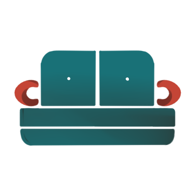

<!-- Improved compatibility of back to top link: See: https://github.com/othneildrew/Best-README-Template/pull/73 -->
<a name="readme-top"></a>


<!-- PROJECT LOGO -->
<br />
<div align="center">
  <a href="https://github.com/github_username/repo_name">
    
  </a>

<h3 align="center">CouchCast</h3>

  <p align="center">
    short project_description
    <br />
 
  
  </p>
</div>


<!-- TABLE OF CONTENTS -->
<details>
  <summary>Table of Contents</summary>
  <ol>
    <li>
      <a href="#about-the-project">About The Project</a>
      <ul>
        <li><a href="#built-with">Built With</a></li>
      </ul>
    </li>
    <li><a href="#installation">Installation</a></li>
    <li><a href="#usage">Usage</a></li>
    <li><a href="#developers">Developers</a></li>
  </ol>
</details>


<!-- ABOUT THE PROJECT -->
## About The Project
Similar to Spotify, our app CouchCast is a user-driven platform that allows users to search the database for a wide selection of TV shows of different genres for them to watch with ease. Users are able to type and search, rate the show, as well as review the show due to their own interest, and gives a chance for other viewers to read the ratings as well.


### Built With

<!-- * [![JQuery][JQuery.com]][JQuery-url]-->
* <a href="https://flyclipart.com/java-logos-download-java-logo-png-892734" title="Java Logos Download - Java Logo PNG"></a> Java
<!-- * [![Java][java.com]][Java-url] -->
<!-- * * [![Android Studio][java.com]][androidStudio-url]-->
* <a href="https://flyclipart.com/android-studio-icon-android-icon-png-502596" title="Android Studio Icon - Android Icon PNG"></a> Android Studio


<!-- GETTING STARTED -->

## Installation

1. Get a free API Key at [The Movie Database API](https://developers.themoviedb.org/3/getting-started/introduction).
2. Clone the repo
   ```sh
   git clone https://github.com/nooralyasiri/CSE3311_AndroidApp.git
   ```
3. Enter your API key for all instances of apiKey in the codebase
4. Build and Compile the code via Android Studio

<p align="right">(<a href="#readme-top">back to top</a>)</p>


<!-- ROADMAP -->
## Usage

- [ ] Authentication
  - [ ] Login
  - [ ] Registration
- [ ] View Trending TV Shows
- [ ] View TV Shows Recently Added to a List by the User
- [ ] Search for TV Shows
    - [ ] View TV Shows from Different Genres on the Same Screen
    - [ ] Autofill Search 
- [ ] Add TV Shows to a List (Favorites, Want to Watch)
- [ ] Rate and Review TV Shows
- [ ] Customize your Profile


<!-- CONTRIBUTING -->
<!-- LICENSE -->
<!-- CONTACT -->
<!-- ## Contact

Your Name - [@twitter_handle](https://twitter.com/twitter_handle) - email@email_client.com

Project Link: [https://github.com/github_username/repo_name](https://github.com/github_username/repo_name)

<p align="right">(<a href="#readme-top">back to top</a>)</p> -->


<!-- ACKNOWLEDGMENTS -->
## Developers

* Noor Alyasiri
* Carolyn Nguyen
* Nicholas Parker
* Anh Pham
* Patricia Rojas 
* Amna Syed 
* Kevin Vu


<!-- MARKDOWN LINKS & IMAGES -->
<!-- https://www.markdownguide.org/basic-syntax/#reference-style-links -->
[contributors-shield]: https://img.shields.io/github/contributors/github_username/repo_name.svg?style=for-the-badge
[contributors-url]: https://github.com/github_username/repo_name/graphs/contributors
[forks-shield]: https://img.shields.io/github/forks/github_username/repo_name.svg?style=for-the-badge
[forks-url]: https://github.com/github_username/repo_name/network/members
[stars-shield]: https://img.shields.io/github/stars/github_username/repo_name.svg?style=for-the-badge
[stars-url]: https://github.com/github_username/repo_name/stargazers
[issues-shield]: https://img.shields.io/github/issues/github_username/repo_name.svg?style=for-the-badge
[issues-url]: https://github.com/github_username/repo_name/issues
[license-shield]: https://img.shields.io/github/license/github_username/repo_name.svg?style=for-the-badge
[license-url]: https://github.com/github_username/repo_name/blob/master/LICENSE.txt
[linkedin-shield]: https://img.shields.io/badge/-LinkedIn-black.svg?style=for-the-badge&logo=linkedin&colorB=555
[linkedin-url]: https://linkedin.com/in/linkedin_username
[product-screenshot]: images/screenshot.png

<!-- [JQuery.com]: https://img.shields.io/badge/jQuery-0769AD?style=for-the-badge&logo=jquery&logoColor=white
[JQuery-url]: https://jquery.com -->
<!-- [java.com]: <a href="https://flyclipart.com/java-logos-download-java-logo-png-892734" title="Java Logos Download - Java Logo PNG"></a>
[Java-url]:https://www.java.com/en/ -->
